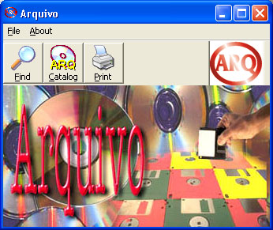



## Arquivo

### Description

After many years recording my documents in Floppy discs, Zip Discs, and CD-R, I felt the necessity to make this program to quickly find the documents that i remembered vacantly only the name.

The procedure is very simple: it is enough to select the drive where is the disc to catalogue (can be one entire hard disk) and attribute it a name for the disk label. A file, with the label name and the extension arq, will keep all the necessary information for future searching.

Later, when you need to locate where is some document, it is enough to enter the name (or part of it) and the program indicates the reference (disc label) of the disc where this document was recorded.

Arquivo, also can print the contents of any catalogued disc. The report is printed for alphabetical order.
 
### More Info
 

             |
---                |---
**Submitted On**   |2002-09-29 14:47:32
**By**             |[Franco Gomes](https://github.com/Planet-Source-Code/PSCIndex/blob/master/ByAuthor/franco-gomes.md)
**Level**          |Advanced
**User Rating**    |4.3 (17 globes from 4 users)
**Compatibility**  |VB 6\.0
**Category**       |[Complete Applications](https://github.com/Planet-Source-Code/PSCIndex/blob/master/ByCategory/complete-applications__1-27.md)
**World**          |[Visual Basic](https://github.com/Planet-Source-Code/PSCIndex/blob/master/ByWorld/visual-basic.md)
**Archive File**   |[Arquivo1379889292002\.zip](https://github.com/Planet-Source-Code/franco-gomes-arquivo__1-39291/archive/master.zip)

### API Declarations

No API

